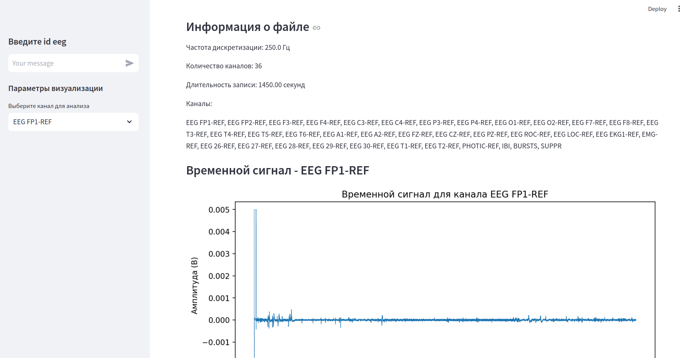

# DDE_project
## Задача и данные

Совместно с AIRI я провожу исследование по созданию Foundation модели для EEG 
данных (энцефалограммы мозга). Уже существуют модели, которые представляют энцефаллограммы
в виде эмбеддингов, например LaBraM. Хотим проверить насколько хорошо получается это делать
на одном из самых известных датасетов TUAB, который содержит информацию о том здоровый человек или нет.

## Сбор данных

Для сбора данных необходимо получить разрешение у держателей датасета по ссылке: 
[TUH](https://isip.piconepress.com/projects/nedc/html/tuh_eeg/).
Далее данные необходимо скачать, причем загрузка будет работать только через ВПН?

## Оценка качества

Из-за специфики данных понять каким образом оценивать качество довольно тяжело:
интерес представляют выборсы, которые появляются при воздействии на человека,
в остальное время энцефаллограмма довольно стабильная. 

Я предлагаю использовать результаты из [статьи](https://mne.tools/1.0/auto_tutorials/time-freq/50_ssvep.html)
по препроцессингу данных, в которой берется SNR и строится по ней спектрограмма.
Чтобы получить более четкую метрику давайте брать топ 5 максимальных значений в таком разложении snr
и брать их среднее. У меня получились следующие значения:

* train_abnormal: 139.44
* train_normal: 65.42
* eval_abnormal: 98.21
* eval_normal: 55.67

Данные обычно считаюся хорошими, если такие значения больше 20.

## Предобработка

Для препроцессинга данных используется файл preprocessing.py. 
Препроцессинг включает в себя: ресемплирование до 200 sample_rate, 
фильтрацию от 0.1 до 75 Hz, Нарезание на окна. Этот препроцессинг обуславливается 
описанием преобработки из LaBraM (модели, на которую мы ориентируемся) 
и обсуждением с научным руководителем.

## Исследование

Были проанализированы каналы, которые содержатся в EEG данных. 
До филтрации было много ненужных каналов:

При обработки теперь также убираются лишние каналы: которые мало где используются.
Оставляем всего 23 канала.

## База данных

В качестве базы данных взят SqLite с тремя таблицами: в одной хранится тренировочные данные из датасета,
в другой оценочные данные и в третьей сырые данные для пересчета выбранной метрики.

Также в качестве метрики можно рассматривать распределение каналов по файлов:
хорошо, если новых каналов не появляется.

Реализована возможность обновлять базу данных.

## Дэшборд

Создан дэшборд, на котором можно посмотреть данные в таблицах:

Также выводится распределение каналов по файлам. Для сырых данные также пересчитывается метрика.

Также добавлена возможность рассмотреть отдельный файл и его параметры:

